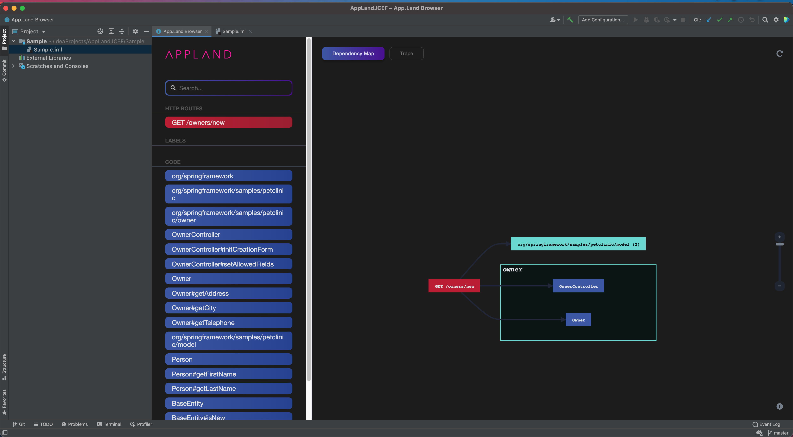

# AppMap for JetBrains IDEs

## System Requirements
**IntelliJ IDEA 2021.3 or later** is required to use this plugin.

Only installations, which use the bundled JetBrains Java runtime, support the JCEF engine for rendering.

## Build
Please make sure that a **Java JDK, version 11 or later** is installed. Building the plugin is only supported with Java 11 or later.

```bash
./gradlew clean build
```

After executing these commands the plugin is available at `./build/distributions/intellij-appmap-<version>.zip`. 

### Releases
The content of `plugin-description.md` is converted into HTML as part of the build process. The HTML content is displayed as description on the JetBrains marketplace and in plugin lists in the IDEs.

The content of `CHANGELOG.md` is converted into HTML as part of the build process and used as content for the plugin's change notes.

1. Optional: Update content of `description.md`.
1. Optional: Update section `[Unreleased]` in file `CHANGELOG.md`. This content will be used for the change notes.
1. Update the `pluginVersion` property in `gradle.properties`, e.g. change `pluginVersion=0.1.0-SNAPSHOT` to `pluginVersion=0.1.0`.
1. Build the plugin ZIP file
    ```bash
    ./gradlew clean build verifyPlugin
    ```
   The build output is located at `./build/distributions/intellij-appmap-<version>.zip`.
1. Optional: Install and test the plugin with one or more IDEs.
1. Upload the file `./build/distributions/intellij-appmap-<version>.zip` as an update on the JetBrains Marketplace.
1. Patch the changelog file:
    ```bash
   ./gradlew patchChangelog
    ```
1. Update the version in `gradle.properties` to include a SNAPSHOT version, e.g. change `pluginVersion=0.1.0` to `pluginVersion=0.2.0-SNAPSHOT`.

## Installation
After building the plugin you can drag & drop the file `./build/distributions/intellij-appmap.zip` onto the main window of IntelliJ to install the plugin. A restart of your IDE is required to use the plugin.

## Usage
A custom file editor is opened when a `.appmap.json` file is opened.
If JCEF is unsupported on your system, then an error message will be shown instead.

## Releasing
- Find the latest official release from [GitHub Releases](https://github.com/getappmap/appmap-intellij-plugin/releases)
- Download the plugin as a `zip` file.
- Open IntelliJ and [install the plugin via the `zip` file](https://www.jetbrains.com/help/idea/managing-plugins.html#install_plugin_from_disk).
- Verify everything is working as intended
    - AppMap rendering
    - Installation instructions
    - Indexing and scanning
    - Authentication
- Navigate to the [AppMap plugin page](https://plugins.jetbrains.com/plugin/16701-appmap).
- As an authorized user, click `Upload Update`.
- Select the officially built plugin zip and upload to the `Stable` channel.

## Screenshot

[Open screenshot](./appmap-intellij.png)


